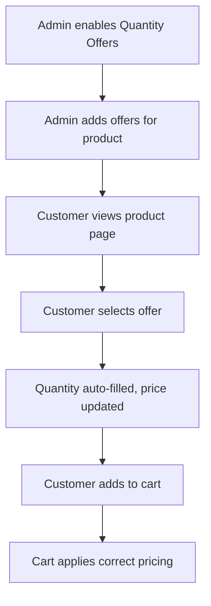

# Offers Price for Quantity in Woo

<p align="center">
  
  
  
  
  
</p>

---

## 🎯 Overview

**Offers Price for Quantity in Woo** is a WooCommerce plugin that lets you create special pricing offers for different product quantities. It adds a dynamic pricing table to product pages, allowing customers to see and select the best deal for bulk purchases. Perfect for stores that want to boost sales with quantity-based discounts!

---

## ✨ Features

| Feature                        | Description                                                                 |
|--------------------------------|-----------------------------------------------------------------------------|
| Quantity-based Offers          | Set custom prices for specific quantities (e.g., 3 for $20, 5 for $30)      |
| Best Seller Highlight          | Mark an offer as "Best Seller" for extra attention                          |
| Admin UI Integration           | Manage offers directly from the WooCommerce product edit screen              |
| Frontend Pricing Table         | Beautiful, interactive pricing table on product pages                        |
| One-click Offer Selection      | Customers can select an offer and auto-fill the quantity                     |
| Savings Display                | Shows how much the customer saves for each offer                             |
| Responsive & Modern Design     | Clean, mobile-friendly UI                                                    |
| Easy Setup                     | No coding required, works out of the box                                     |
| Multilingual Ready             | Supports translation via .pot files                                          |

---

## 🖼️ Visuals & UI

### Product Page Pricing Table

```
+-----------------------------+
|   Special Offers            |
+-----------------------------+
|  3 pieces   |  $20   | Save $4 |
|  5 pieces   |  $30   | Save $10|
| 10 pieces  |  $55   | Save $25|
+-----------------------------+
| [Best Seller] 5 pieces      |
+-----------------------------+
```

> **Tip:** The actual UI is styled with gold highlights, badges, and interactive selection. Add your own screenshots here:

```

```

---

## 🚀 Installation

1. **Download the Plugin:**
   - Download `offers-price-for-quantity.php` or the full plugin zip.
2. **Upload to WordPress:**
   - Go to `Plugins > Add New > Upload Plugin` in your WordPress admin.
   - Select the plugin file and click **Install Now**.
3. **Activate:**
   - Click **Activate** after installation.
4. **Requires:**
   - WooCommerce 5.0+ (tested up to 8.0)
   - WordPress 6.0+ (tested up to 6.8)
   - PHP 7.3+

---

## ⚙️ Usage & Configuration

### 1. Enable Quantity Offers for a Product
- Edit any WooCommerce product.
- In the **Product Data** panel, go to the **Pricing** tab.
- Check **Enable Quantity Offers**.

### 2. Add Offers
- Use the **Quantity Offers** table to add multiple offers:
  - Set the quantity (e.g., 3, 5, 10)
  - Set the total price for that quantity
  - Enable/disable each offer
  - Mark one as **Best Seller** (optional)

### 3. Save Product
- Click **Update** or **Publish**.

### 4. Customer Experience
- On the product page, customers see a pricing table:
  - Each offer shows quantity, total price, and savings
  - "Best Seller" is highlighted
  - Clicking an offer auto-selects the quantity and can add to cart

---

## 🛠️ Example: Admin Offer Table

```
+----------+------------------------+--------------+-------------+--------+
| Quantity | Total Price for Qty    | Enable Offer | Best Seller | Action |
+----------+------------------------+--------------+-------------+--------+
|    3     |        $20             |     [x]      |     ( )     |  [+]   |
|    5     |        $30             |     [x]      |    (•)      |  [-]   |
|   10     |        $55             |     [x]      |     ( )     |  [-]   |
+----------+------------------------+--------------+-------------+--------+
```

---

## 🧩 How It Works (Flow Diagram)



---

## 📝 FAQ

**Q: What happens if WooCommerce is not active?**
- The plugin will show an admin notice and not run.

**Q: Can I set different offers for each product?**
- Yes! Each product can have its own set of offers.

**Q: Is it compatible with variable products?**
- Currently, it is designed for simple products. Variable support may be added in the future.

**Q: How do I translate the plugin?**
- Use the included `.pot` file in `/languages` or tools like Loco Translate.

---

## 🧑‍💻 Developer Notes
- Hooks into `woocommerce_product_options_pricing`, `woocommerce_before_add_to_cart_button`, and `woocommerce_before_calculate_totals`.
- All data is stored as product meta (`_sqp_enable`, `_sqp_quantity_offers`).
- Frontend uses jQuery for offer selection and UI updates.
- Fully translatable and follows WordPress coding standards.

---

## 🏆 Credits
- Developed by [Yousef Abdallah](https://rakmyat.com/)
- Inspired by WooCommerce community needs

---

## 📜 Changelog

### 1.0.0
- Initial release: Quantity-based offers, admin UI, frontend pricing table, best seller badge, savings display.

---

## 📬 Support & Feedback
- For issues, feature requests, or contributions, open a GitHub issue or contact the author via [rakmyat.com](https://rakmyat.com/).

---

## 📷 Screenshots (Add Yours!)
- `assets/screenshots/frontend-table.png` – Pricing table on product page
- `assets/screenshots/admin-offers.png` – Admin offer table

> _Tip: To add screenshots, create an `assets/screenshots/` folder and upload your images. Then update the image links above._
